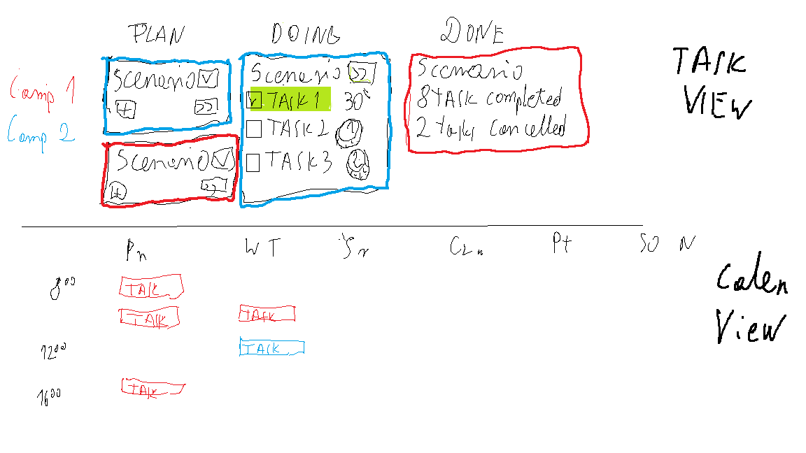
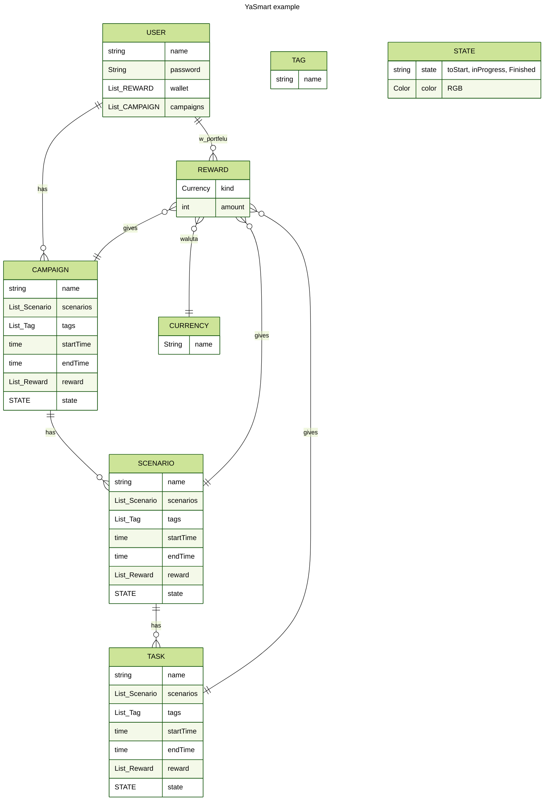

# Pomysł 
pomysł na mały projekt. 
## Założenia
Wykonać projekt w Springu, przypomnieć sobie podstawy Springa i przerobic na nim kurs EAI
#### Cel:
- spring w zakresie EAI
- walidacja
- jpa
- front: Thymeleaf lub prosty Angular, do rozważenia
- testy
- cleancode
#### Opcjonalnie
- Security
- Security w Angularze
#### Nie-Cel
- dopieszczanie frontu
- spędzić zbyt dużo czasu na szczegółach
## Projekt
Coś podobne do Asany/Trello, bardziej zorientowane monitorowanie czasu który pochłonęło zadanie, a nie na pilnowanie dedlajnów. dodatkowo Gamification: możliwość dodawania nagród do poszczególnych zadań:
- 3 poziomy ważnośći Campaign > Scenario > Task
- Tasks są krótkie, trwają minuty do godziny
- za wykonanie Task, Scen,Camp są nagrody
- przy zaznaczeniu Tasku podaje się czas trwania
- Task view -> do edycji
- calendar view do patrzenia
  

## Etapy
### 0.5
- Rest API do dodawania Task/Campaign/Scenario
- Odpytywanie DB do TaskView
- przesuwanie Scenario Z PLan -> DOing -> ToDo
- 1 Dummy user

### 0.7
- Front (Task View) do 0.5
  
### 0.9
- Rest API Edycja Task/Campaign
- Users
- User Panel

### 1.0
-Front  (Task View) do 0.9

## A potem:
### Route A
- Spring Security

### Route B
- calendar view
  
