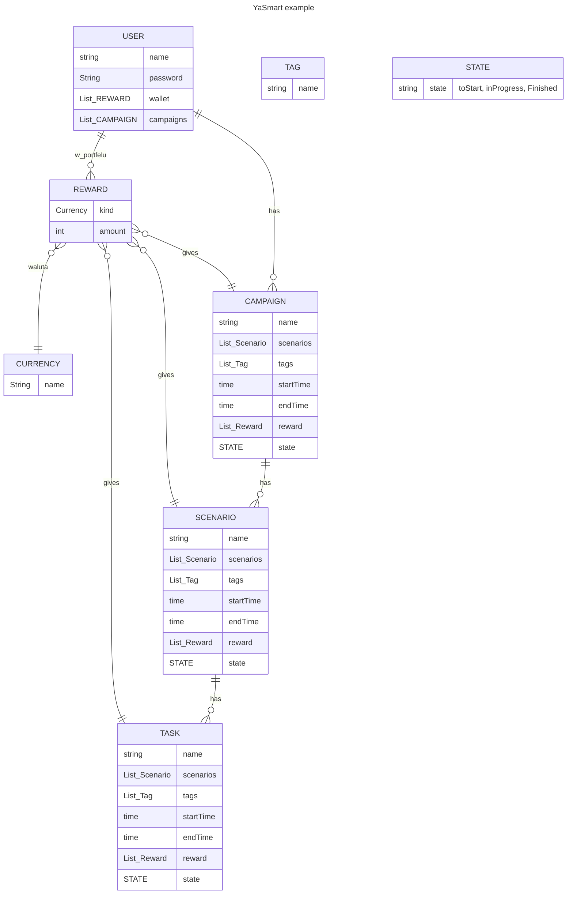

# Pomysł 
pomysł na mały projekt. 
## Założenia
Wykonać projekt w Springu, przypomnieć sobie podstawy Springa i przerobic na nim kurs EAI
#### Cel:
- spring w zakresie EAI
- walidacja
- jpa
- front: Thymeleaf lub prosty Angular, do rozważenia
- testy
- cleancode
#### Opcjonalnie
- Security
- Security w Angularze
#### Nie-Cel
- dopieszczanie frontu
- spędzić zbyt dużo czasu na szczegółach
## Projekt
Coś podobne do Asany/Trello, bardziej zorientowane monitorowanie czasu który pochłonęło zadanie, a nie na pilnowanie dedlajnów. dodatkowo Gamification: możliwość dodawania nagród do poszczególnych zadań

killer
